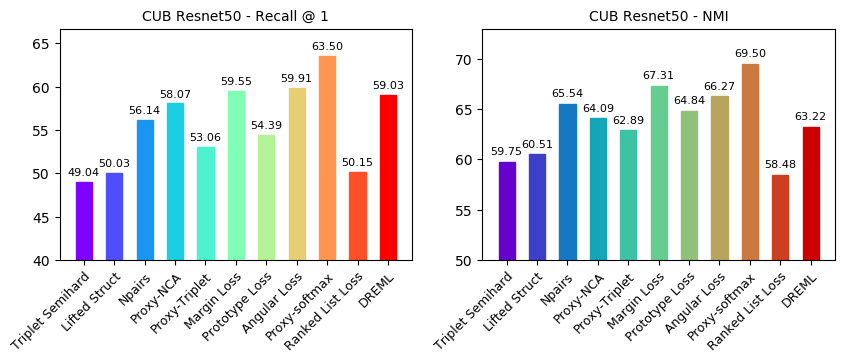
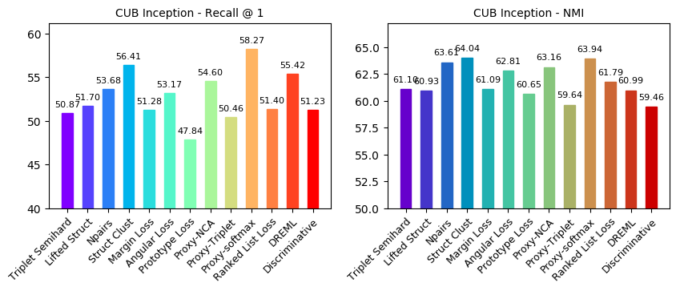
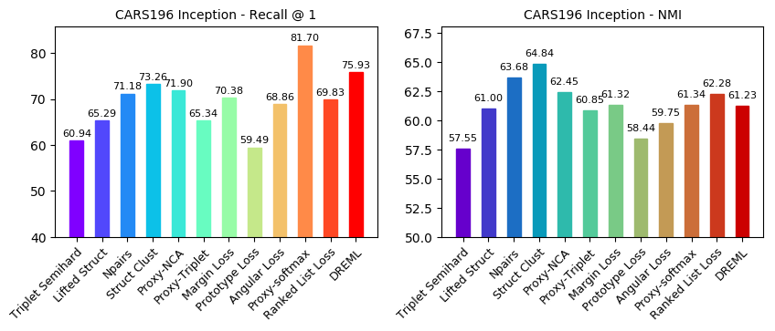
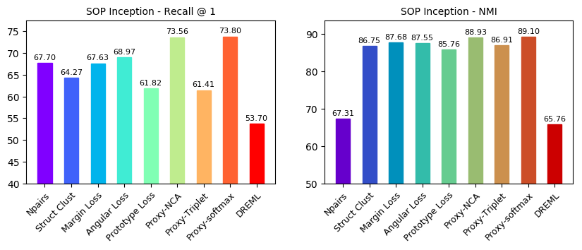
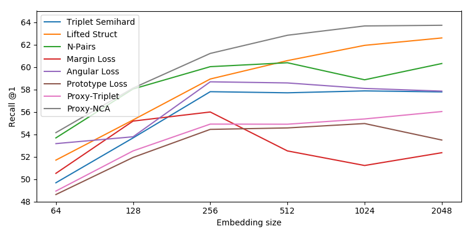
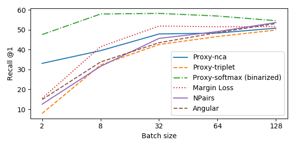

Distance Metric Learning Playground
-------

This repository contains code for the paper [_Unbiased Evaluation of Deep Metric Learning Algorithms_](https://arxiv.org/abs/1911.12528). Several Deep Metric Learning (DML) algorithms
were trained and evaluated on the [CUB200-2011](http://www.vision.caltech.edu/visipedia/CUB-200-2011.html), [Cars196](https://ai.stanford.edu/~jkrause/cars/car_dataset.html)
 and [SOP](http://cvgl.stanford.edu/resources.html) datasets. The aim is to create a testbed for benchmarking future DML methods under fair conditions.
 Every algorithm is implemented with Apache (Incubating) MXNet 1.5+. Python 2.7 and 3.5+ is supported.

Currently supporting the following algorithms:

1. Triplet loss with semi-hard mining (2015) [[arXiv]](https://arxiv.org/abs/1503.03832)
2. Deep Metric Learning via Lifted Structured Feature Embedding (2015) [[arXiv]](https://arxiv.org/abs/1511.06452)
3. Improved Deep Metric Learning with Multi-class N-pair Loss Objective (2016) [[NIPS]](https://papers.nips.cc/paper/6200-improved-deep-metric-learning-with-multi-class-n-pair-loss-objective)
4. Deep Metric Learning via Facility Location (2016) [[arXiv]](https://arxiv.org/abs/1612.01213v2) (requires MXNet 1.5+)
5. Sampling Matters in Deep Embedding Learning (2017) [[arXiv]](https://arxiv.org/abs/1706.07567)
6. Prototypical Networks for Few-shot Learning (2017) [[arXiv]](https://arxiv.org/abs/1703.05175)
7. No Fuss Distance Metric Learning using Proxies (2017) [[arXiv]](https://arxiv.org/abs/1703.07464)
8. Deep Metric Learning with Angular Loss (2017) [[arXiv]](https://arxiv.org/abs/1708.01682)
9. Making Classification Competitive for Deep Metric Learning (2018) [[arXiv]](https://arxiv.org/abs/1811.12649)
10. Deep Randomized Ensembles for Metric Learning (2018) [[arXiv]](https://arxiv.org/abs/1808.04469)
11. Ranked List Loss for Deep Metric Learning (2019) [[arXiv]](https://arxiv.org/abs/1903.03238)
12. A Theoretically Sound Upper Bound on the Triplet Loss for Improving the Efficiency of Deep Distance Metric Learning (2019) [[arXiv]](https://arxiv.org/abs/1904.08720)

Results
-------
Every experiment is run on an AWS P3.2xlarge EC2 instance using one V100 GPU. We measure recall @1 and 
[normalized mutual information (NMI)](https://course.ccs.neu.edu/cs6140sp15/7_locality_cluster/Assignment-6/NMI.pdf).
Results are averages after 10 runs with different seeds. Sample logs are provided in the results folder along with hyperparameters.

Every method is evaluated under the following conditions:

- [Inception-BN](https://arxiv.org/abs/1502.03167) architecture pretrained on ImageNet
- Images are resized to 256x256 then randomly cropped to 224x224 in training, center cropped in testing
- Embedding size is 64
- Bounding box annotations (where available) are not used









### Effects of the embedding size



### Effect of training batch size



How to use
-------
There is a separate script for each algorithm as in the table below.
Type `script_name.py --help` for a list of parameters and settings.

| Paper | Script        |
|---------|---------------|
| 1. Triplet loss with semi-hard mining | train_triplet_semihard.py |
| 2. Deep Metric Learning via Lifted Structured Feature Embedding | train_liftedstruct.py |
| 3. Improved Deep Metric Learning with Multi-class N-pair Loss Objective | train_npairs.py |
| 4. Deep Metric Learning via Facility Location | train_clusterloss.py |
| 5. Sampling Matters in Deep Embedding Learning | train_margin.py |
| 6. Prototypical Networks for Few-shot Learning | train_prototype.py |
| 7. No Fuss Distance Metric Learning using Proxies | train_proxy.py |
| 8. Deep Metric Learning with Angular Loss | train_angular.py |
| 9. Making Classification Competitive for Deep Metric Learning | train_normproxy.py |
| 10. Deep Randomized Ensembles for Metric Learning | train_dreml.py |
| 11. Ranked List Loss for Deep Metric Learning | train_rankedlistloss.py |
| 12. A Theoretically Sound Upper Bound on the Triplet Loss for Improving the Efficiency of Deep Distance Metric Learning | train_discriminative.py |

Paper
-------
If you find this repository useful please consider citing our paper:

```
@misc{fehervari2019unbiased,
    title={Unbiased Evaluation of Deep Metric Learning Algorithms},
    author={Istvan Fehervari and Avinash Ravichandran and Srikar Appalaraju},
    year={2019},
    eprint={1911.12528},
    archivePrefix={arXiv},
    primaryClass={cs.LG}
}
```

License
-------
Licensed under an [Apache-2.0](https://github.com/apache/incubator-mxnet/blob/master/LICENSE) license.